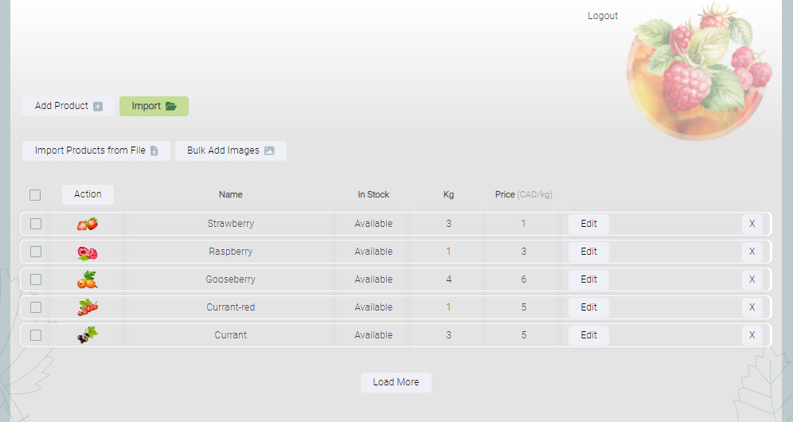

# Berries - Online Shop Admin Page (Dashboard)

**Berries** is a React project designed for practicing and testing CRUD (Create, Read, Update, Delete) operations. It is a part of an online shop application, specifically focused on the admin page for managing products.
Some of the features of this project may be currently under development, so please come back later to see the final results.

## Purpose

The main purpose of this project is to gain hands-on experience with CRUD operations, which are essential for developing and managing product listings in an e-commerce application. By building this project, I aim to enhance my skills and understanding of React and state management.

## Features

- Create, update, and delete product listings.
- Display a list of products along with their corresponding images.
- Import data from a .csv file.
- Bulk import of images.
- Bulk operations on products, such as editing the price or kilograms of several products simultaneously.
- Bulk deletion.
- Authentication feature: To have access to the operations, the user must authenticate.
- CSS animation and effects.

## Tools

The Front-End block was created using React.js and pure CSS.
The Back-End part was implemented with Node.js, Express, and Multer.
The database is set up using MongoDB (Mongoose).
Authentication was achieved using the Google Firebase SDK.

## Screenshots starting with the Landing page

## Login or Sign up

## Main page of the Dashboard

## Add, Edit or Delete products

